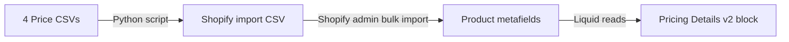

# Pricing Details v2 Implementation

> Exported from Antigravity Storage Manager on 4/8/2026, 10:14:26 AM
> Conversation ID: `7c3ce0b2-6275-424a-9827-29a969f65bd6`

---

## Conversation Messages

*Raw extracted content:*

---

## Artifacts

### implementation_plan.md

# Pricing Details v2 — Revised Plan (Metafield-Based)

## Why the Change

Shopify's native B2B catalog pricing (`variant.quantity_price_breaks`) is **not accessible in Liquid** for non-logged-in visitors, and returned empty even for logged-in B2B customers in testing. The solution: store all pricing tiers directly as **product metafields** (JSON arrays), which are always readable by Liquid regardless of login state.

## Data Flow



## Metafield Structure

Four metafields per product, stored as **JSON strings** in the `custom` namespace:

| Metafield Key | Namespace | Type | Example Value |
|---|---|---|---|
| `retail_price_breaks` | `custom` | `json` | `[{"quantity":5,"price":85.29},{"quantity":24,"price":77.69}]` |
| `silver_price_breaks` | `custom` | `json` | `[{"quantity":5,"price":68.23},{"quantity":24,"price":62.15}]` |
| `gold_price_breaks` | `custom` | `json` | `[{"quantity":5,"price":68.23},{"quantity":24,"price":62.15}]` |
| `platinum_price_breaks` | `custom` | `json` | `[{"quantity":5,"price":68.23},{"quantity":24,"price":62.15}]` |

Each JSON array contains objects with `quantity` (int) and `price` (float), sorted by ascending quantity.

## Proposed Changes

### Data Import

#### [NEW] generate_metafield_import.py

Python script that:
1. Reads all 4 pricing CSVs from `ballProData02/priceData/`
2. Groups rows by SKU (Item No.)
3. Builds JSON arrays of `{quantity, price}` for each SKU
4. Outputs a single Shopify-compatible CSV for bulk metafield import

---

### Snippet

#### [MODIFY] [pricing-details-v2.liquid](file:///Users/shawnplep/WebProjects/ballProTheme/snippets/pricing-details-v2.liquid)

Update pricing logic:
1. **Remove** the B2B catalog path (Path A)
2. **Remove** the debug panel
3. **New logic**: Check `customer.tags` for silver/gold/platinum → load the matching metafield. Default: `custom.retail_price_breaks`
4. Parse the JSON metafield and render the same table styling

---

## Verification Plan

1. Run the Python script to generate the import CSV
2. Import via Shopify Admin → Settings → Metafields (bulk import)
3. Test product page: non-logged-in → Retail prices shown
4. Test product page: logged-in with "silver" tag → Silver prices shown
5. Test EQP section and configurable row count


### implementation_plan.md.metadata.json

```
{
  "artifactType":  "ARTIFACT_TYPE_IMPLEMENTATION_PLAN",
  "summary":  "Revised implementation plan switching from Shopify B2B catalog pricing (which proved inaccessible via Liquid) to a metafield-based approach. Four JSON metafields per product (retail, silver, gold, platinum) will store price breaks. A Python script converts the existing CSVs to Shopify metafield import format. The Liquid snippet uses customer tags to select the correct metafield. Includes full data flow, metafield structure, snippet logic, and import steps.",
  "updatedAt":  "2026-02-26T19:14:32.718997Z",
  "version":  "1"
}
```

### task.md

# Pricing Details v2 Implementation

## Tasks

- [x] Research existing Pricing Details implementation
- [x] Create implementation plan
- [x] Implement initial `pricing-details-v2.liquid` snippet (catalog-based — failed)
- [x] Add `pricing_details_v2` block type to schema and template
- [x] Debug: confirmed B2B catalog pricing inaccessible via Liquid
- [x] Examine pricing CSV data structure across all 4 tiers
- [x] Revise plan: switch to metafield-based approach

### Phase 2: Metafield-Based Pricing
- [x] Create Python script to generate metafield import CSV
- [ ] User exports Products.csv from Shopify, then runs script
- [ ] User imports output CSV into Shopify admin
- [x] Update `pricing-details-v2.liquid` to read from metafields + customer tags
- [x] Remove debug panel
- [ ] Deploy and verify


### task.md.metadata.json

```
{
  "artifactType":  "ARTIFACT_TYPE_TASK",
  "summary":  "Updated task checklist reflecting completion of metafield import script and updated Liquid snippet. Remaining: user export Products.csv, run script, import data, deploy and test.",
  "updatedAt":  "2026-02-26T19:19:47.809743Z",
  "version":  "4"
}
```

### walkthrough.md

# Pricing Details v2 — Walkthrough

## What Was Built

A new **Pricing Details v2** block that automatically shows the correct pricing based on customer type:

| Customer State | Data Source | What They See |
|---|---|---|
| Not logged in | `product.metafields.b2b.price_breaks` | Retail pricing |
| Logged in, not B2B | `product.metafields.b2b.price_breaks` | Retail pricing |
| Logged in, B2B company | `variant.quantity_price_breaks` | Their catalog pricing (Silver/Gold/Platinum) |

Shopify auto-resolves the correct catalog based on the customer's company location — no tags needed.

## Files Changed

| File | Change |
|---|---|
| [pricing-details-v2.liquid](file:///Users/shawnplep/WebProjects/ballProTheme/snippets/pricing-details-v2.liquid) | **[NEW]** Main snippet with two paths: Path A (B2B catalog) and Path B (Retail metafield) |
| [main-product.liquid](file:///Users/shawnplep/WebProjects/ballProTheme/sections/main-product.liquid) | Added `pricing_details_v2` block type to schema (lines 234–271) |
| [product-information-blocks.liquid](file:///Users/shawnplep/WebProjects/ballProTheme/snippets/product-information-blocks.liquid) | Added rendering case for `pricing_details_v2` (lines 567–570) |
| [product.json](file:///Users/shawnplep/WebProjects/ballProTheme/templates/product.json) | Added `pricing_details_v2_block` entry, disabled old `pricing_details_NphPi7` |

## How It Works

The snippet logic in `pricing-details-v2.liquid`:

1. Checks `customer.b2b?` and `variant.quantity_price_breaks_configured?`
2. If both true → **Path A**: renders from `variant.quantity_price_breaks` (catalog pricing)
3. Otherwise → **Path B**: renders from `product.metafields.b2b.price_breaks.value` (Retail)
4. Both paths produce identical visual output (same table styling, EQP section, setup charges)

## Verification Needed

Deploy the theme and test these scenarios:

- [ ] **Unauthenticated visitor** → sees Retail metafield pricing
- [ ] **Logged-in non-B2B user** → sees Retail metafield pricing
- [ ] **B2B Silver customer** → sees Silver catalog pricing via `variant.quantity_price_breaks`
- [ ] **B2B Gold customer** → sees Gold catalog pricing
- [ ] **B2B Platinum customer** → sees Platinum catalog pricing
- [ ] **EQP section** appears when breaks exceed configured count (for logged-in users)
- [ ] **"Number of Price Breaks to Display"** setting works in theme editor


### walkthrough.md.metadata.json

```
{
  "artifactType":  "ARTIFACT_TYPE_WALKTHROUGH",
  "summary":  "Walkthrough documenting the Pricing Details v2 implementation — four files changed, B2B catalog-aware pricing with metafield fallback.",
  "updatedAt":  "2026-02-26T18:04:00.507290Z"
}
```
